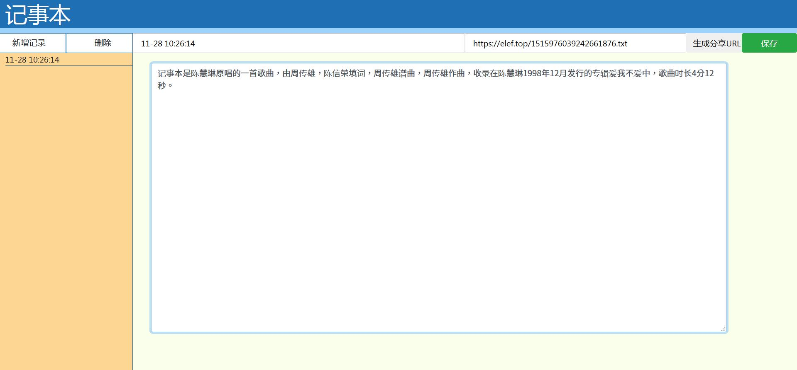

# webpad
- 升级版本地址[https://notepad2.cn/](https://notepad2.cn/)
- 采用本地存储(local storage)的记事本
- 借助于elef.top的临时存储功能，可将记事本内容分享给其他人
- 感谢[TomatoYuyuko](https://github.com/TomatoYuyuko)的前台页面改进
- 感谢[wf1314](https://github.com/wf1314)建议支持MD格式，暂时只实现了分享为MD格式。

